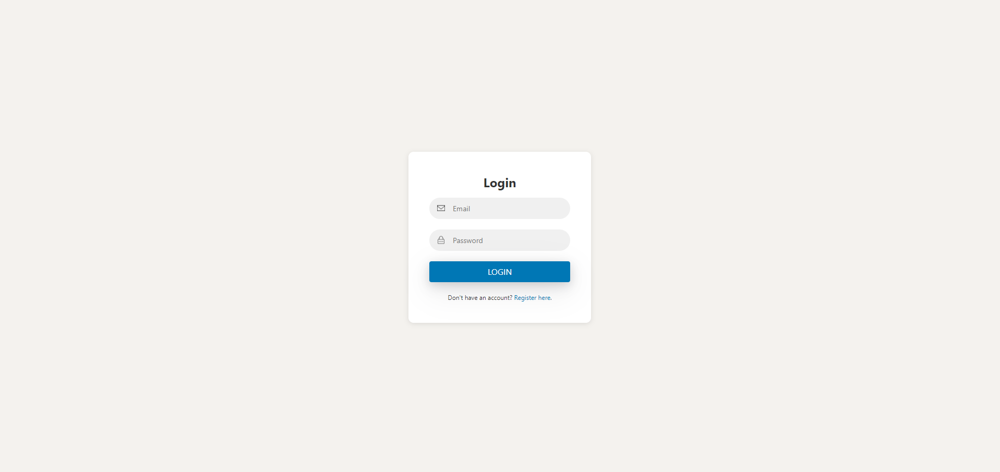
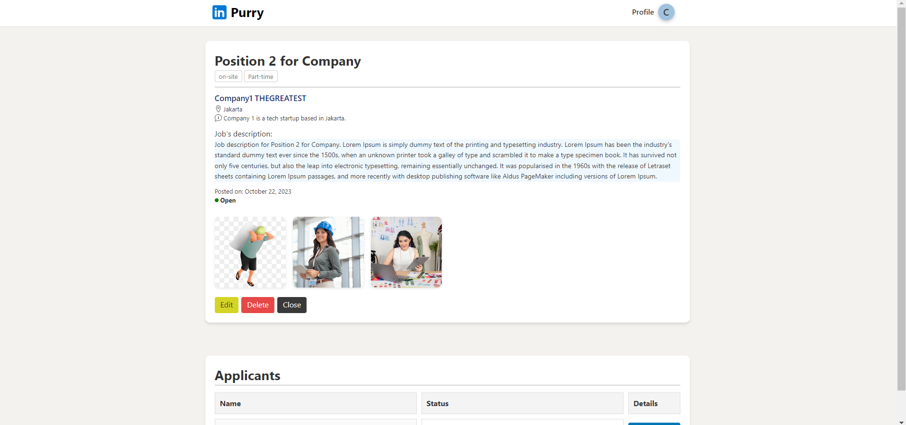
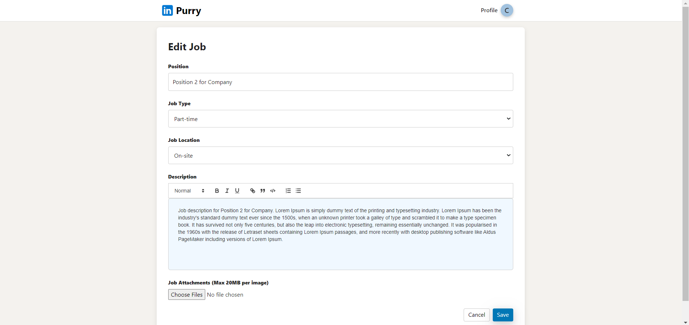
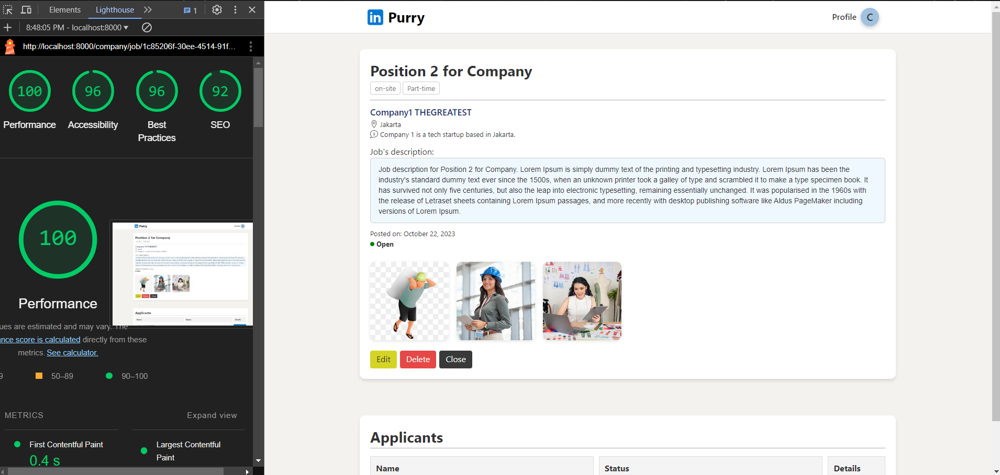
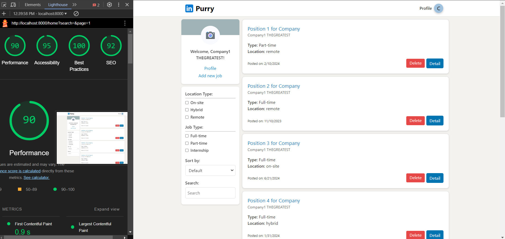

# Tugas Besar IF3110 2024/2025

## Description
This application (LinkinPurry) serves as a job platform with two distinct user types: job seekers and companies, providing a streamlined experience for job searching and recruitment processes. The application ensures that users are authenticated to access most of its features, with specific features available for unauthenticated users. This application is similar to the famous application, namely LinkedIn

## Requirement
- **Docker**: This project uses Docker for containerization. Make sure to install Docker Desktop, which includes Docker Compose. You can download it from the [Docker website](https://www.docker.com/products/docker-desktop).


## How to Install
1. Clone the repository from GitHub:
   ```bash
   git clone https://github.com/yourusername/your-repository-name.git
   ```
2. Navigate into the cloned directory:
    ```bash
   cd your-repository-name
   ```

## How to Run

- Copy the .env.example to .env

- Then start the docker
    ```bash
    docker compose up --build
    ```

- Accessing the page
    ```
    http://localhost:8080
    ```

> ### Error Handling

If you encounter ```./config/seed.sh: file not found``` error, please copy the contents of ```seed.sh```, delete ```seed.sh```, and paste the copied contents to new ```seed.sh``` file. This error usually happened when the ```seed.sh``` file is downloaded from repo.

## Screenshots
- Main Pages









- Lighthouse score








## Work Responsibilities
| **Component**    | **Functionality** | **NIM**                 | 
|------------------|-------------------|-------------------------|
| **Server-side**  | Login             | `13522098`              | 
|                  | Logout            | `13522098`              | 
|                  | Register          | `13522098`              | 
|                  | Create job        | `13522098, 13522097`    | 
|                  | Edit job          | `13522104, 13522097`    | 
|                  | Applicant job     | `13522098`              | 
|                  | Profile company   | `13522104`              |
|                  | History           | `13522098`              | 
|                  | Storage/database  | `13522098`              | 
|                  | Data export       | `13522098`              |  
| **Client-side**  | Login             | `13522098`              | 
|                  | Register          | `13522098`              | 
|                  | Home (Job Seeker) | `13522098`              | 
|                  | Detail Lowongan   | `13522098`              | 
|                  | Lamaran           | `13522098`              | 
|                  | Riwayat           | `13522098`              | 
|                  | Home (Company)    | `13522097`              | 
|                  | Tambah Lowongan   | `13522098`              | 
|                  | Detail Lamaran    | `13522097`              | 
|                  | Edit Lowongan     | `13522104`              | 
|                  | Profil            | `13522104`              | 
|                  | Edit Profil       | `13522104`              | 

## Completed Bonuses
- All responsive web design
- UI/UX like LinkedIn
- Data export excel and csv
- Good score of lighthouse